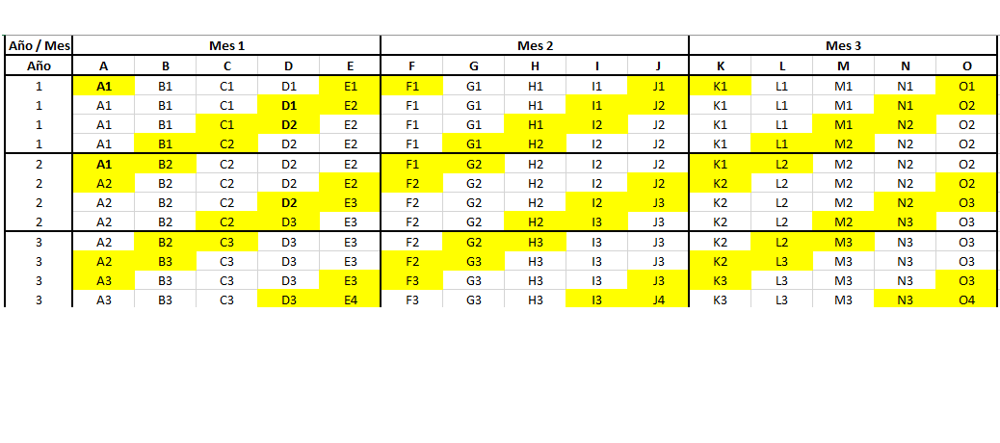

```{r setup, include=FALSE}
knitr::opts_chunk$set(echo = TRUE)
```

Cargamos los paquetes, necesarios y funciones para establecer las rotaciones durante el período intercensal en cada uno de los estratos que se definan. Para efectos de este ejercicio se aplicarán las rotaciones considerando como estratos las regiones con los tamaños establecidos para un período de 13 años.

```{r, warning=FALSE, message=FALSE}
library(samplesize4surveys)
library(SamplingCoordination)
library(dplyr)
library(readxl)
library(writexl)
library(flextable)
```

En primer lugar calculamos el tamaño de muestra trimestral para la desocupación, exportamos los archivos de parámetros:

```{r, warning=FALSE, message=FALSE}
df_parametrostablas_desocupacion <- read_excel("ParametrosTablasMuestreo_Desempleo.xlsx") 
```

```{r, warning=FALSE, message=FALSE}
f_tablaMue_desocupacion <- function(df_parametrostablas, str_region, cve, m){
  temp <-  df_parametrostablas %>% filter(Agregacion == str_region) 
  
  N <- temp$N
  M <- temp$M
  P = temp$P
  #cve <- temp$cve
  conf <- temp$conf
  r1 <- temp$r1
  r2 <- temp$r2
  b <-  temp$b  # Personas por hogar
  deff <- temp$deff
  
  nro_vivXUPM <- temp$nro_vivXUPM
  PM <- temp$PM # Perdida de Muestra
  TR <- temp$TR # Tasa de resupesta
  
  # Calculamos alpha, z, icc
  r <- r1  * r2 # Tasa de población afectada (dado que es un parámetro a nivel de persona)
  nbarra_encuesta <- nro_vivXUPM * b * r # Personas
  alpha <- 1 - conf
  z <- qnorm(1-alpha/2)
  icc <- (deff - 1) / (nbarra_encuesta - 1) 
  
    
  # Tabla de muestreo 
  tabla_mue <- ss4HHSp(N,
  M, # Recuendo no poderado
  r,  # tasa que afecta
  b, 
  rho = icc,
  P, 
  delta =  cve * z, #  Error estándar relativo,
  conf, m = m)
  
  # Aumenta el número de personas por UPM
  tabla_mue$HouseholdsPerPSU_Adjusted = ceiling(tabla_mue$HouseholdsPerPSU  /  ((1-PM) * TR))
  
  # Ya que informante idoneo es un miembro del hogar
  tabla_mue$HouseholdsInSample_Adjusted <- tabla_mue$HouseholdsPerPSU_Adjusted * 
                                          tabla_mue$PSUinSample 
  tabla_mue$PersonsInSample_Adjusted <- round(tabla_mue$HouseholdsInSample_Adjusted *  b * r) 

  tabla_mue$ajuste_perdida <- ((1-PM) * TR)
  tabla_mue$n_personaXhogar <- b * r
  tabla_mue$cve <- cve
 
  tabla_mue$M <- M
  tabla_mue$N <- N
  
  tabla_mue <- tabla_mue %>% relocate(cve)
  tabla_mue <- tabla_mue %>% relocate(n_personaXhogar)
  tabla_mue <- tabla_mue %>% relocate(ajuste_perdida)

  tabla_mue <- tabla_mue %>% relocate(M)
  tabla_mue <- tabla_mue %>% relocate(N)
  tabla_mue
  }
```

```{r, warning=FALSE, message=FALSE}
f_tablaMue_PobrezaExtrema <- function(df_parametrostablas, str_region, cve, m){
  temp <-  df_parametrostablas %>% filter(Agregacion == str_region) 
  
  N <- temp$N
  M <- temp$M
  P = temp$P
  #cve <- temp$cve
  conf <- temp$conf
  r <- temp$r

  b <-  temp$b  # Personas por hogar
  deff <- temp$deff
  
  PM <- temp$PM # Perdida de Muestra
  TR <- temp$TR # Tasa de resupesta
  
  # Calculamos alpha, z, icc
  nbarra_encuesta <- temp$nro_vivXUPM # Personas
  alpha <- 1 - conf
  z <- qnorm(1-alpha/2)
  icc <- (deff - 1) / (nbarra_encuesta - 1) 
  
    
  # Tabla de muestreo 
  tabla_mue <- ss4HHSp(N,
  M, # Recuendo no poderado
  r,  # tasa que afecta
  b, 
  rho = icc,
  P, 
  delta =  cve * z, #  Error estándar relativo,
  conf, m = m)
  
 
  tabla_mue$HouseholdsPerPSU_Adjusted = ceiling(tabla_mue$HouseholdsPerPSU  /  ((1-PM) * TR))
  tabla_mue$HouseholdsInSample_Adjusted <- tabla_mue$HouseholdsPerPSU_Adjusted *  
                                            tabla_mue$PSUinSample 

  tabla_mue$ajuste_perdida <- ((1-PM) * TR)
  tabla_mue$M <- M
  tabla_mue$N <- N
  tabla_mue$cve <- cve
 
  tabla_mue <- tabla_mue %>% relocate(cve)
  tabla_mue <- tabla_mue %>% relocate(ajuste_perdida)
  tabla_mue <- tabla_mue %>% relocate(M)
  tabla_mue <- tabla_mue %>% relocate(N)
  tabla_mue
  }
```

El tamaño de muestra nacional es:

```{r, warning=FALSE, message=FALSE}
tabla_Nacional <- f_tablaMue_desocupacion(df_parametrostablas_desocupacion, "Nacional", cve = 0.025 , m = 6)
```

Se realiza la optimización del cve para la zona urbano y rural:

```{r, warning=FALSE, message=FALSE}
f_optimizacion_cve_zona <- function(cve_param){
cve_num <- cve_param 
suma_psu <- f_tablaMue_desocupacion(df_parametrostablas_desocupacion, 
                        str_region = "Zona_Urbana", 
                        cve = cve_num , m = 6)$PSUinSample +
f_tablaMue_desocupacion(df_parametrostablas_desocupacion, 
                        str_region = "Zona_Rural", 
                        cve = cve_num, m = 6)$PSUinSample     

return(abs(tabla_Nacional$PSUinSample - suma_psu))  
}
```

Usar una grilla para encontrar el cve deseado óptimo para zona urbana y rural y coincida con el nacional:

```{r, warning=FALSE, message=FALSE}
grilla_zona <- seq(df_parametrostablas_desocupacion$cve_original[2] - 0.005, df_parametrostablas_desocupacion$cve_original[2] + 0.005, by =  0.00001)

vctr_optim_zona <- length(seq_along(grilla_zona))
for( i in seq_along(grilla_zona) ){
vctr_optim_zona[i] <- f_optimizacion_cve_zona(grilla_zona[i])
}
names(vctr_optim_zona) <- grilla_zona 
solucion_zona <- names(vctr_optim_zona[abs(vctr_optim_zona) <= 1]) %>% as.numeric()
solucion_zona <- min(solucion_zona)
```

El tamaño de muestra por área urbano:

```{r, warning=FALSE, message=FALSE}
tabla_zonaUrbana <- f_tablaMue_desocupacion(df_parametrostablas_desocupacion, "Zona_Urbana", cve = solucion_zona,  m = 6)
```

El tamaño de muestra por área rural:

```{r, warning=FALSE, message=FALSE}
 tabla_zonaRural <- f_tablaMue_desocupacion(df_parametrostablas_desocupacion, "Zona_Rural",  cve = solucion_zona,  m = 6)
```

Verificamos la coherencia por área:

```{r, warning=FALSE, message=FALSE}
tabla_zonaUrbana$PSUinSample + tabla_zonaRural$PSUinSample
```

# Tamaño de muestra de desempleo por regiones

Se realiza la optimización del cve para las regiones:

```{r, warning=FALSE, message=FALSE}
f_optimizacion_cve_region <- function(cve_param){
cve_num <- cve_param 
suma_psu <- f_tablaMue_desocupacion(df_parametrostablas_desocupacion, 
                        str_region = "Region_Central", 
                        cve = cve_num , m = 6)$PSUinSample +
f_tablaMue_desocupacion(df_parametrostablas_desocupacion, 
                        str_region = "Region_Chorotega", 
                        cve = cve_num, m = 6)$PSUinSample +
f_tablaMue_desocupacion(df_parametrostablas_desocupacion, 
                        str_region = "Region_Pacifica_Central", 
                        cve = cve_num, m = 6)$PSUinSample +
f_tablaMue_desocupacion(df_parametrostablas_desocupacion, 
                        str_region = "Region_Brunca", 
                        cve = cve_num, m = 6)$PSUinSample +
f_tablaMue_desocupacion(df_parametrostablas_desocupacion, 
                        str_region = "Region_Huetar_Atlantico", 
                        cve = cve_num, m = 6)$PSUinSample +
f_tablaMue_desocupacion(df_parametrostablas_desocupacion, 
                        str_region = "Region_Huetar_Norte", 
                        cve = cve_num, m = 6)$PSUinSample 
return(abs(tabla_Nacional$PSUinSample - suma_psu))  
}
```

Usar una grilla para encontrar el cve deseado óptimo para zona urbana y rural y coincida con el nacional:

```{r, warning=FALSE, message=FALSE}
grilla_region <- seq(df_parametrostablas_desocupacion$cve_original[4] - 0.005, df_parametrostablas_desocupacion$cve_original[4] + 0.005, by =  0.00001)

vctr_optim_region <- length(seq_along(grilla_region))
for( i in seq_along(grilla_region) ){
vctr_optim_region[i] <- f_optimizacion_cve_region(grilla_region[i])
}
names(vctr_optim_region) <- grilla_region 
solucion_region <- names(vctr_optim_region[abs(vctr_optim_region) <= 1]) %>% as.numeric()
solucion_region <- min(solucion_region)
```

El tamaño de muestra por zonas:

```{r, warning=FALSE, message=FALSE}
tabla_regionCentral <- f_tablaMue_desocupacion(df_parametrostablas_desocupacion, "Region_Central", cve = solucion_region, m = 6)
tabla_regionChorotega <- f_tablaMue_desocupacion(df_parametrostablas_desocupacion, "Region_Chorotega", solucion_region, m = 6)
tabla_regionPacificaCentral <- f_tablaMue_desocupacion(df_parametrostablas_desocupacion, "Region_Pacifica_Central", solucion_region, m = 6)
tabla_regionBrunca <- f_tablaMue_desocupacion(df_parametrostablas_desocupacion, 
                                              "Region_Brunca", solucion_region, m = 6)
tabla_regionHuetarAtlantico <- f_tablaMue_desocupacion(df_parametrostablas_desocupacion, "Region_Huetar_Atlantico", solucion_region, m = 6)
tabla_regionHuetarNorte <- f_tablaMue_desocupacion(df_parametrostablas_desocupacion, "Region_Huetar_Norte", solucion_region, m = 6)
```

Verificamos la coherencia del número de UPMs:

```{r, warning=FALSE, message=FALSE}
consulta_PSU <- data.frame(PSUinSample_Nacional = tabla_Nacional$PSUinSample,
           PSUinSample_Zona = tabla_zonaUrbana$PSUinSample + tabla_zonaRural$PSUinSample,
PSUinSample_Region = tabla_regionCentral$PSUinSample + tabla_regionChorotega$PSUinSample +
tabla_regionPacificaCentral$PSUinSample + tabla_regionBrunca$PSUinSample +
tabla_regionHuetarAtlantico$PSUinSample + tabla_regionHuetarNorte$PSUinSample, check.names = F)
flextable::flextable(consulta_PSU)
```

El tamaño de muestra considerado será de 3526 a nivel nacional, urbano y regional. El número total de hogares a realizar es de: `r 3526 * 8` hogares

```{r, eval = FALSE, echo = FALSE}
"28.208 hogares"
```

# Tamaño de muestra acumulada anual para la encuesta de pobreza

El tamaño anterior se ejecuta en 15 de los 15 paneles que se disponen cada trimestre, en contraste dado que el módulo de pobreza se realiza en la primera y quinta visita, el tamaño de muestra de pobreza necesario se realiza en únicamente 6 de los 15 paneles cada trimestre, es decir en un año en 24 de estos paneles.

Ver imagen:



En cada trimestre el tamaño de muestra es 6/15 \* tamaño de muestra de UPMs que se realiza para estudiar desempleo. En un año este tamaño de muestra será

4 \* 6/15 el tamaño de muestra de UPMs que se plantea para desempleo, es decir: 24/15 \* tamaño de muestra de UPMs de desempleo.

```{r}
df_tamMueUPM_Pobreza <- data.frame(tamUPM_pobrezaAnual = round(3526 * 24 / 15))
df_tamMueUPM_Pobreza %>% flextable::flextable()
```

Por otro lado, el tamaño en número de hogares es de:

```{r}
df_tamMueHogares_Pobreza <- df_tamMueUPM_Pobreza * 8
df_tamMueHogares_Pobreza %>% flextable::flextable()

```

Estas cantidades satisfacen los requerimientos para estimar la pobreza extrema que se estimaron a partir de las tablas de muestreo:

```{r}
df_parametrostablas_pobrezaExtrema <- read_excel("ParametrosTablasMuestreo_PobrezaExtrema.xlsx")

```

Debido a la coincidencia entre el tamaño de muestra acumulado con el de requerimiento de pobreza se pueden utilizar las siguientes tablas de muestreo para pobreza extrema.

```{r}

tabla_Nacional_PE <- f_tablaMue_PobrezaExtrema(
  df_parametrostablas = df_parametrostablas_pobrezaExtrema, 
  str_region = "Nacional", cve = 0.022,
                            m = 6)

tabla_Nacional_PE %>% flextable::flextable()
```

Las exigencias anuales de pobreza están alineadas con las exigencias al acumular la desocupación.


# Salidas tablas de muestreo


Las salidas para las tablas de desocupación trimestrales son:

```{r}
tabla_Nacional$Agregacion <- "Nacional"
tabla_zonaUrbana$Agregacion <- "Zona_Urbana"
tabla_zonaRural$Agregacion <- "Zona_Rural"

tabla_regionCentral$Agregacion <- "Region_Central"
tabla_regionChorotega$Agregacion <- "Region_Chorotega"
tabla_regionPacificaCentral$Agregacion <- "Region_PacificaCentral"
tabla_regionBrunca$Agregacion <- "Region_Brunca"
tabla_regionHuetarAtlantico$Agregacion <- "Region_HuetarAtlantico"
tabla_regionHuetarNorte$Agregacion <- "Region_Norte"


tabla_desocupacion <- bind_rows(tabla_Nacional, tabla_zonaUrbana, tabla_zonaRural,
          tabla_regionCentral,tabla_regionChorotega,  tabla_regionPacificaCentral,
          tabla_regionBrunca, tabla_regionHuetarAtlantico, tabla_regionHuetarNorte)

tabla_desocupacion <- tabla_desocupacion %>% relocate(Agregacion)
tabla_desocupacion$ajuste_perdida <- round(tabla_desocupacion$ajuste_perdida,2)
tabla_desocupacion$n_personaXhogar  <- round(tabla_desocupacion$n_personaXhogar     , 2)
tabla_desocupacion$cve     <- round(tabla_desocupacion$cve, 3)

tabla_desocupacion %>% flextable::flextable()
```


Las tablas de pobreza se generan a partir de las desocupación:


```{r}
tabla_Nacional_PE <- tabla_Nacional
tabla_zonaUrbana_PE <- tabla_zonaUrbana
tabla_zonaRural_PE <- tabla_zonaRural

tabla_regionCentral_PE <- tabla_regionCentral
tabla_regionChorotega_PE <- tabla_regionChorotega
tabla_regionPacificaCentral_PE <- tabla_regionPacificaCentral
tabla_regionBrunca_PE <- tabla_regionBrunca
tabla_regionHuetarAtlantico_PE <- tabla_regionHuetarAtlantico
tabla_regionHuetarNorte_PE <- tabla_regionHuetarNorte

tabla_pobreza_extrema <- bind_rows(tabla_Nacional_PE, tabla_zonaUrbana_PE,
                                   tabla_zonaRural_PE,
                                 tabla_regionCentral_PE, tabla_regionChorotega_PE,
                                tabla_regionPacificaCentral_PE,  tabla_regionBrunca_PE, tabla_regionHuetarAtlantico_PE, tabla_regionHuetarNorte_PE)

tabla_pobreza_extrema <- tabla_pobreza_extrema %>% relocate(Agregacion)
tabla_pobreza_extrema$ajuste_perdida <- round(tabla_pobreza_extrema$ajuste_perdida,2)
tabla_pobreza_extrema$n_personaXhogar  <- round(tabla_pobreza_extrema$n_personaXhogar     , 2)
tabla_pobreza_extrema$cve     <- round(tabla_pobreza_extrema$cve, 3)

tabla_pobreza_extrema$N <- NULL
tabla_pobreza_extrema$M <- NULL
tabla_pobreza_extrema$ajuste_perdida  <- NULL
tabla_pobreza_extrema$cve  <- NULL
tabla_pobreza_extrema$DEFF  <- NULL

tabla_pobreza_extrema$PersonsInSample <- NULL
tabla_pobreza_extrema$PersonsInSample_Adjusted <- NULL
tabla_pobreza_extrema$PersonsPerPSU <- NULL

tabla_pobreza_extrema$PSUinSample <- ceiling(tabla_pobreza_extrema$PSUinSample * 24/15)

tabla_pobreza_extrema$HouseholdsInSample  <- (tabla_pobreza_extrema$HouseholdsInSample  * 24/15) %>%  ceiling()

tabla_pobreza_extrema$HouseholdsPerPSU_Adjusted   <- (tabla_pobreza_extrema$HouseholdsPerPSU_Adjusted   * 24/15) %>% 
  ceiling()

tabla_pobreza_extrema$HouseholdsInSample_Adjusted  <- (tabla_pobreza_extrema$HouseholdsInSample_Adjusted  * 24/15) %>% 
  ceiling()
tabla_pobreza_extrema %>% flextable::flextable()
```


